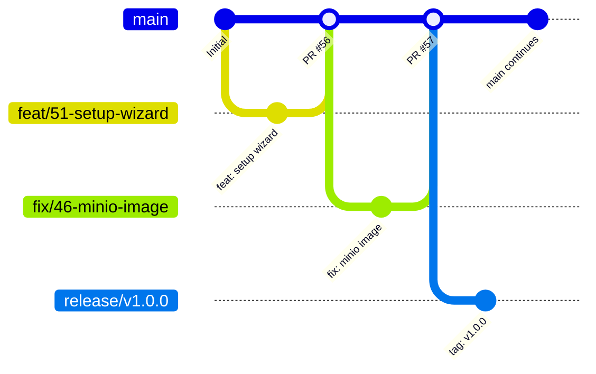

# Branching Strategy & Release Workflow

This document outlines the standard Git branching strategy, naming conventions, and release lifecycle for the **Lake of Tears** project.

---

## Overview

Lake of Tears follows **GitHub Flow with Release Branches**. This combines the simplicity of continuous delivery for features with the stability required for versioned milestones (such as `version 1.0.0`) and hotfixes.

> [!IMPORTANT]
> **Mandatory Ticket Tracking Rule: No Commits Without a Ticket**
> Every commit, topic branch, and pull request in this repository **must be linked to an open GitHub issue/ticket number** (e.g., branch `feat/51-...`, commit message referencing `(#51)`). Commits without an accompanying tracking ticket are strictly prohibited to maintain full auditability and traceability of changes.



---

## 1. Branch Hierarchy

### Long-Lived Branches

| Branch | Description | Protected? | Target PR |
| :--- | :--- | :--- | :--- |
| `main` | Production-ready, always passing CI. Contains the latest stable code. | **Yes** (Requires PR review & passing CI) | Features, bugs, security tasks |
| `release/vX.Y.Z` | Frozen stabilization branch for a specific release milestone. | **Yes** | Hotfixes and version bumps |

---

## 2. Topic / Working Branches

All work must be conducted on short-lived branches created from `main`.

### Naming Conventions

Prefix branch names with the type of change and include the corresponding GitHub issue number:

| Type | Format | Example | Purpose |
| :--- | :--- | :--- | :--- |
| **Feature** | `feat/<issue#>-<description>` | `feat/51-first-time-setup-wizard` | New functionality or capabilities |
| **Bug Fix** | `fix/<issue#>-<description>` | `fix/46-minio-image-references` | Resolving bugs or defects |
| **Security** | `sec/<issue#>-<description>` | `sec/52-upgrade-jwt-multipart` | CVE fixes, security patches |
| **Infrastructure** | `infra/<issue#>-<description>` | `infra/49-setup-local-script` | Helm, Docker, CI/CD, Terraform |
| **Documentation** | `docs/<issue#>-<description>` | `docs/branching-strategy` | Documentation improvements |
| **Refactoring** | `refactor/<issue#>-<description>` | `refactor/duckdb-connection-pool` | Code cleanup with no functional change |

*Note: Always use lowercase kebab-case (hyphens) for descriptions.*

---

## 3. Contributor Workflow

### Step 1: Sync and Branch
Always pull the latest changes from `main` before creating your branch:
```bash
git checkout main
git pull origin main
git checkout -b feat/51-first-time-setup-wizard
```

### Step 2: Commit Messages (Conventional Commits)
Write clear, structured commit messages adhering to [Conventional Commits](https://www.conventionalcommits.org/):
```
<type>(<scope>): <subject>

[optional body]

[optional footer(s)]
```
*Examples:*
* `feat(ui): add step-by-step setup wizard template`
* `fix(helm): make mc client image configurable in minio template`
* `sec(deps): upgrade PyJWT to 2.15.0 and python-multipart to 0.0.31`

### Step 3: Open a Pull Request
1. Push your branch to GitHub:
   ```bash
   git push -u origin feat/51-first-time-setup-wizard
   ```
2. Open a Pull Request targeting `main`.
3. In the PR description, link the issue using GitHub closing keywords:
   ```markdown
   Closes #51
   ```
4. Verify all CI status checks pass.

### Step 4: Merging
* **Squash and Merge:** Required for all topic branches into `main` to maintain a clean, linear git log.
* The branch is automatically deleted upon merge.

---

## 4. Release Lifecycle (e.g. `version 1.0.0`)

When all issues and milestones for a target version are merged into `main`:

### 1. Cutting a Release Branch
Create a release branch from `main`:
```bash
git checkout main
git pull origin main
git checkout -b release/v1.0.0
```

### 2. Version Bump and Validation
* Update version numbers in:
  * `pyproject.toml`
  * `deploy/helm/lake-of-tears/Chart.yaml` (both `version` and `appVersion`)
* Run final integration checks and smoke tests.

### 3. Tagging and Publishing
Create an annotated SemVer Git tag:
```bash
git tag -a v1.0.0 -m "Release v1.0.0"
git push origin release/v1.0.0 --tags
```
Merge the version bump back into `main`.

---

## 5. Hotfix Workflow

If a critical bug is discovered in a released version (e.g., `v1.0.0`):

1. **Branch from the Release:**
   ```bash
   git checkout release/v1.0.0
   git checkout -b fix/<issue#>-critical-patch
   ```
2. **Apply and Test Fix:**
   Commit the fix and open a PR targeting `release/v1.0.0`.
3. **Tag Patch Release:**
   Tag `v1.0.1` on `release/v1.0.0`.
4. **Backport to Main:**
   Cherry-pick or merge the hotfix commit into `main` so future versions retain the fix:
   ```bash
   git checkout main
   git cherry-pick <commit-sha>
   git push origin main
   ```
